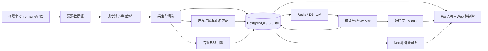

# 烛微 ZhuWei


> 烛微是一套面向企业安全运营和产品安全团队的本地化漏洞情报工作台，将多源采集、告警研判、产品归属、源码证据、模型分析和图谱关系整合到一个可私有化部署的控制台中。
>
> ZhuWei is a self-hosted vulnerability intelligence workspace for security operations and product security teams, combining multi-source ingestion, alert triage, product attribution, source-code evidence, model-assisted analysis, and graph relationships in one private console.

烛微（ZhuWei）是一套面向漏洞情报监测、产品归属分析、漏洞研判和源码证据管理的本地化安全情报平台。系统以 Python/FastAPI 为后端，内置单页 Web 控制台，支持多源漏洞采集、告警筛选、产品库对齐、模型辅助分析、源码上传归档、MinIO 对象存储、Neo4j 图谱、Redis 队列和 PostgreSQL 数据库部署。

ZhuWei is a localized vulnerability intelligence platform for vulnerability monitoring, product attribution, analysis workflows, and source-code evidence management. It uses a Python/FastAPI backend with an embedded web console, and supports multi-source ingestion, alert triage, product alignment, model-assisted analysis, source archive management, MinIO object storage, Neo4j graph visualization, Redis queues, and PostgreSQL deployment.

> 当前项目适合内网安全运营、产品安全跟踪、漏洞情报原型系统和授权安全研究场景。请仅在合法授权范围内使用。
>
> This project is intended for internal security operations, product security tracking, vulnerability intelligence prototypes, and authorized security research only.

## 目录 / Table Of Contents

- [核心能力 / Core Capabilities](#核心能力--core-capabilities)
- [系统架构 / Architecture](#系统架构--architecture)
- [技术栈 / Tech Stack](#技术栈--tech-stack)
- [快速启动 / Quick Start](#快速启动--quick-start)
- [Docker 部署 / Docker Deployment](#docker-部署--docker-deployment)
- [配置说明 / Configuration](#配置说明--configuration)
- [功能使用 / Usage](#功能使用--usage)
- [数据源 / Data Sources](#数据源--data-sources)
- [模型分析 / Model-Assisted Analysis](#模型分析--model-assisted-analysis)
- [源码库 / Source Archive](#源码库--source-archive)
- [图谱 / Graph](#图谱--graph)
- [热更新 / Hot Update](#热更新--hot-update)
- [API 概览 / API Overview](#api-概览--api-overview)
- [安全说明 / Security Notes](#安全说明--security-notes)
- [项目结构 / Project Structure](#项目结构--project-structure)
- [相关文档 / Documentation](#相关文档--documentation)

## 核心能力 / Core Capabilities

### 中文

- 多源漏洞情报采集：CISA KEV、NVD、biu.life、长亭 VulDB、OSCS、微步、Seebug、AVD、CNVD、启明星辰、Struts2 官方公告、Doonsec 微信 RSS 等。
- 数据源健康中心：记录最近成功/失败时间、平均耗时、错误类型、连续失败次数和入库趋势。
- 告警中心：按严重等级、关键词、时间窗口和去重策略筛选高价值漏洞；Doonsec WeChat RSS 当前只入库，不进入告警处理。
- 产品库：支持产品归属、产品别名、厂商字典、产品合并、产品详情页和产品-漏洞关系对齐。
- 漏洞分析：支持标准分析、重新分析、红队增强分析、人工选择 Flash/Pro 模型、分析置信度、来源可信度、用户反馈和分析日志查看。
- 模型源切换：可在前端配置模型 URL、API Key、Flash 模型名和 Pro 模型名。
- 源码库：支持用户上传源码包，后台异步分析源码架构、功能和产品归属，并可上传到 MinIO。
- 本地源码优先：漏洞分析会优先使用已归档源码，对比告警版本和本地源码版本；必要时再搜索线上源码。
- 图谱能力：支持 Neo4j 同步产品、漏洞、告警、源码库等关系，并在前端查看、缩放和筛选。
- 浏览器代理：为 CNVD、AVD 等站点提供容器化 Chrome/noVNC 访问，用于获取 cookie/session 后进行抓取。
- 热更新：前端上传 `.update` 包后，后端按结构化 manifest 确定性应用补丁并生成日志、报告和变更结果。

### English

- Multi-source vulnerability ingestion: CISA KEV, NVD, biu.life, Chaitin VulDB, OSCS, ThreatBook, Seebug, Alibaba AVD, CNVD, Venustech, Apache Struts2 bulletins, Doonsec WeChat RSS, and more.
- Source health center: tracks last success/failure time, average duration, error categories, consecutive failures, and ingestion trends.
- Alert center: filters high-value vulnerabilities by severity, keywords, time window, and deduplication rules. Doonsec WeChat RSS is currently ingested into the database only and does not create alerts.
- Product catalog: supports product attribution, aliases, vendor dictionaries, product merging, product detail pages, and product-vulnerability relationship alignment.
- Vulnerability analysis: supports standard analysis, re-analysis, red-team enhanced analysis, manual Flash/Pro model selection, confidence labels, source credibility, feedback, and detailed logs.
- Model source switching: configure model URL, API key, Flash model name, and Pro model name from the web console.
- Source archive: users can upload source packages; the backend asynchronously analyzes architecture, functionality, and product attribution, then stores artifacts in MinIO.
- Local-source-first analysis: vulnerability analysis prefers retained local source code, compares alert versions with local versions, and only searches online source code when needed.
- Graph capability: sync products, vulnerabilities, alerts, and source archives into Neo4j and visualize relationships in the frontend.
- Browser proxy: containerized Chrome/noVNC sessions for CNVD/AVD-style sources to obtain cookies and sessions for scraping.
- Hot update: upload `.update` packages, deterministically apply structured manifest operations, and inspect logs, reports, and change results.

## 系统架构 / Architecture

### 中文



系统由以下模块组成：

- `backend/app/sources`: 数据源适配器。
- `backend/app/services.py`: 调度任务运行、入库、告警、产品对齐。
- `backend/app/analysis.py`: 漏洞分析队列、模型调用、日志记录、结果回填。
- `backend/app/source_archive.py`: 源码上传、解包、架构分析、MinIO 上传。
- `backend/app/neo4j_graph.py`: 图谱数据同步和查询。
- `backend/app/browser_proxy.py`: 容器化浏览器代理和 cookie/session 捕获。
- `frontend`: 内置 Web 控制台。

### English

The system consists of source adapters, schedulers, ingestion pipelines, product attribution, alert rules, analysis workers, source archive management, object storage, graph synchronization, and a built-in web console.

- `backend/app/sources`: source adapters.
- `backend/app/services.py`: scheduled runs, ingestion, alert processing, and product alignment.
- `backend/app/analysis.py`: vulnerability analysis queues, model calls, logging, and result persistence.
- `backend/app/source_archive.py`: source uploads, extraction, architecture analysis, and MinIO upload.
- `backend/app/neo4j_graph.py`: graph synchronization and queries.
- `backend/app/browser_proxy.py`: containerized browser proxy and session capture.
- `frontend`: embedded web console.

## 技术栈 / Tech Stack

| Layer | 中文 | English |
| --- | --- | --- |
| Backend | Python 3.11+ / FastAPI / APScheduler | Python 3.11+ / FastAPI / APScheduler |
| Frontend | 原生 HTML/CSS/JavaScript 单页控制台 | Native HTML/CSS/JavaScript single-page console |
| Database | SQLite 或 PostgreSQL | SQLite or PostgreSQL |
| Queue | Redis 或数据库队列 | Redis or database queue |
| Object Storage | MinIO | MinIO |
| Graph | Neo4j | Neo4j |
| Browser Automation | Playwright、本机 Chrome、容器化 Chrome/noVNC | Playwright, local Chrome, containerized Chrome/noVNC |
| Model Runtime | Claude Code CLI + Anthropic-compatible endpoint, e.g. DeepSeek | Claude Code CLI + Anthropic-compatible endpoint, e.g. DeepSeek |

## 快速启动 / Quick Start

### 本机启动 / Local Start

```bash
cd /path/to/ZhuWei
./start.sh
```

启动脚本会自动创建虚拟环境、安装依赖、创建数据目录并启动服务。服务启动时会在控制台输出随机登录 token。

The start script creates a virtual environment, installs dependencies, creates data directories, and starts the service. A random login token is printed to stdout on every startup.

访问 / Open:

```text
http://127.0.0.1:8010/login
```

常用启动参数 / Common options:

```bash
PORT=8020 ./start.sh
HOST=0.0.0.0 PORT=8010 ./start.sh
RELOAD=1 ./start.sh
INSTALL_PLAYWRIGHT=1 ./start.sh
SKIP_DEPENDENCY_INSTALL=1 ./start.sh
```

macOS 用户也可以双击 `start.command`。

macOS users can also double-click `start.command`.

## Docker 部署 / Docker Deployment

### 中文

Linux 云服务器推荐使用 Docker Compose，默认会启动应用、PostgreSQL、Redis、MinIO 和 Neo4j。

```bash
./scripts/docker_start.sh init-env
vim .env.docker
./scripts/docker_start.sh up
```

国内网络环境可使用内置镜像源配置：

```bash
./scripts/docker_compose_cn.sh
./scripts/docker_start.sh up
```

### English

Docker Compose is recommended for Linux servers. The default stack starts the app, PostgreSQL, Redis, MinIO, and Neo4j.

```bash
./scripts/docker_start.sh init-env
vim .env.docker
./scripts/docker_start.sh up
```

For mainland China networks, use the preconfigured domestic mirrors:

```bash
./scripts/docker_compose_cn.sh
./scripts/docker_start.sh up
```

更多细节见 / See also:

- [Docker 部署文档 / Docker Deployment Guide](docs/docker-deployment.md)
- [Docker Compose 国内源部署 / China Mirror Compose Guide](docs/docker-compose-cn.md)

## 配置说明 / Configuration

### 核心配置 / Core Settings

| Variable | 中文说明 | English Description |
| --- | --- | --- |
| `SESSION_SECRET` | Session 签名密钥，生产环境必须修改 | Session signing secret; change in production |
| `DATABASE_BACKEND` | `sqlite` 或 `postgresql` | `sqlite` or `postgresql` |
| `DATABASE_URL` | PostgreSQL 连接串 | PostgreSQL connection URL |
| `REDIS_URL` | Redis 地址 | Redis URL |
| `QUEUE_BACKEND` | `redis` 或数据库队列 | `redis` or database queue |
| `MINIO_ENDPOINT` | MinIO 地址 | MinIO endpoint |
| `SOURCE_UPLOAD_MAX_MB` | 源码包上传大小上限 | source archive upload size limit |
| `SOURCE_EXTRACT_MAX_FILES` | 源码包抽样解压文件数上限 | max extracted files for source sampling |
| `SOURCE_EXTRACT_MAX_MB` | 源码包抽样解压总体积上限 | max extracted bytes for source sampling |
| `SOURCE_EXTRACT_MAX_FILE_MB` | 单个源码文件解压上限 | max size per extracted source file |
| `NEO4J_URI` | Neo4j Bolt 地址 | Neo4j Bolt URI |
| `ANTHROPIC_BASE_URL` | Anthropic-compatible 模型 URL | Anthropic-compatible model endpoint |
| `DEEPSEEK_API_KEY` | DeepSeek API Key，可在前端保存 | DeepSeek API key; can also be saved in the frontend |
| `ANTHROPIC_MODEL` | 默认 Pro 模型 | Default Pro model |
| `ANTHROPIC_DEFAULT_HAIKU_MODEL` | 默认 Flash 模型 | Default Flash model |
| `VULN_ANALYSIS_TIMEOUT_SECONDS` | 漏洞分析超时时间 | Vulnerability analysis timeout |
| `VULN_SOURCE_RETENTION_DAYS` | 本地源码保留天数 | Source retention days |
| `UPDATE_ENCRYPTION_KEY` | `.update` 解密密钥，支持 base64/hex/passphrase | `.update` decryption key, base64/hex/passphrase |
| `UPDATE_REQUIRE_ENCRYPTION` | 是否强制只接受加密更新包 | whether encrypted updates are required |

### 模型源配置 / Model Source

前端“模型源”页面支持配置：

- 模型 URL，例如 `https://api.deepseek.com/anthropic`
- API Key
- Flash 模型名，例如 `deepseek-v4-flash`
- Pro 模型名，例如 `deepseek-v4-pro[1m]`

The frontend model-source panel supports:

- model URL, for example `https://api.deepseek.com/anthropic`
- API key
- Flash model name, for example `deepseek-v4-flash`
- Pro model name, for example `deepseek-v4-pro[1m]`

API Key 只应保存在本地 `.env` 或数据库配置中，不要提交到 Git 或打包产物。

API keys should stay in local `.env` or database settings. Do not commit or package secrets.

## 功能使用 / Usage

### 中文

1. 登录：访问 `/login`，输入启动日志中的随机 token。
2. Dashboard：查看漏洞总量、告警数量、分析状态、POC/EXP 情况和数据源概览。
3. 数据源：在配置页查看数据源健康状态，手动运行常规源或低频源。
4. 告警：在告警中心按等级、数据源、状态和关键词筛选高价值漏洞。
5. 产品库：查看产品列表、最新漏洞、产品详情、趋势、严重等级分布、别名和合并建议。
6. 漏洞分析：点击“漏洞分析 / 重新分析 / 红队增强”，弹窗选择 Flash 或 Pro 模型后入队。
7. 分析详情：查看摘要、POC、EXP、修复建议、参考来源、模型日志和用户反馈。
8. 源码库：上传源码包，确认产品名或新建产品，查看分析结果、MinIO 状态和源码列表。
9. 图谱：同步 Neo4j 后查看产品、漏洞、告警、源码之间的关系。
10. 更新：上传 `.update` 包，查看更新分析、日志、报告和变更状态。

### English

1. Login: open `/login` and enter the random token printed at startup.
2. Dashboard: review vulnerability counts, alerts, analysis status, POC/EXP status, and source summaries.
3. Sources: inspect source health and manually run regular or slow sources.
4. Alerts: filter high-value vulnerabilities by severity, source, status, and keywords.
5. Products: inspect products, latest vulnerabilities, trends, severity distribution, aliases, and merge suggestions.
6. Analysis: click "Analyze / Re-analyze / Red-team Enhance", then choose Flash or Pro in the model picker.
7. Analysis details: inspect summary, POC, EXP, remediation, references, model logs, and feedback.
8. Source archive: upload source packages, confirm or create product names, inspect analysis results, MinIO status, and archives.
9. Graph: sync Neo4j and visualize relationships among products, vulnerabilities, alerts, and source archives.
10. Updates: upload `.update` packages and inspect update analysis, logs, reports, and change status.

## 数据源 / Data Sources

### regular

- `cisa_kev`: CISA Known Exploited Vulnerabilities
- `biu_rss`: biu.life RSS
- `biu_products`: biu.life 产品库 / product catalog
- `doonsec_wechat`: Doonsec WeChat RSS, 入库但不告警 / ingested but excluded from alerts
- `nvd_recent`: NVD Recent CVE
- `chaitin_vuldb`: Chaitin VulDB
- `oscs_intel`: OSCS Open Source Intel
- `threatbook_vuln`: ThreatBook Vulnerability
- `seebug_vuldb`: Seebug VulDB

### slow

- `avd_high_risk`: Alibaba AVD High Risk
- `cnvd_list`: CNVD List
- `venustech_notice`: Venustech Security Notice
- `struts2_bulletin`: Apache Struts2 Security Bulletins

### 告警规则 / Alert Rules

默认规则 / Defaults:

- 最低等级 / minimum severity: `high`
- 时间窗口 / time window: 30 days
- CVE 去重 / CVE deduplication: enabled
- 黑白名单关键词 / keyword allowlist and blocklist: configurable

Doonsec WeChat RSS 当前被视为低质量源：只进入漏洞库和产品对齐，不进入告警处理。

Doonsec WeChat RSS is currently treated as a low-confidence source: it is stored and aligned to products, but does not create alerts.

## 模型分析 / Model-Assisted Analysis

### 中文

漏洞分析使用 Claude Code CLI 和 Anthropic-compatible 模型接口。当前支持：

- 标准分析：公开 POC/EXP 搜索、源码检索、根因分析、修复建议。
- 红队增强：在授权场景下以攻击视角分析公开证据、源码证据和利用条件。
- 人工选模型：每次点击“漏洞分析 / 重新分析 / 红队增强”时弹出模型选择框，选择 Flash 或 Pro。
- 结果标签：分析结果保存并展示实际使用模型，例如 `Flash · deepseek-v4-flash`。
- 日志追踪：POC、EXP、修复建议区域可打开模型日志，查看模型参数、stdout/stderr、JSON 结果摘要、token 和模型使用信息。
- 用户反馈：支持“有用 / 无用”，用于后续优化提示词和评估质量。

### English

Vulnerability analysis uses Claude Code CLI with an Anthropic-compatible model endpoint. It supports:

- Standard analysis: public POC/EXP search, source-code lookup, root-cause analysis, and remediation advice.
- Red-team enhanced analysis: authorized attack-perspective analysis based on public and source-code evidence.
- Manual model selection: every "Analyze / Re-analyze / Red-team Enhance" action opens a Flash/Pro model picker.
- Result labels: analysis results persist and display the actual model used, for example `Flash · deepseek-v4-flash`.
- Log tracing: POC, EXP, and remediation panels can open model logs including model parameters, stdout/stderr, JSON result summaries, token usage, and model usage.
- Feedback: "Useful / Not useful" feedback helps improve prompts and quality evaluation.

## 源码库 / Source Archive

### 中文

源码库用于沉淀用户上传或分析过程中发现的源码证据：

- 支持 zip、tar 和常见源码包上传。
- 后端异步解包、生成 manifest、分析语言/框架/依赖/功能。
- Flash 模型可辅助识别源码架构、功能和对应产品。
- 用户需要确认产品名，或选择新建产品，再完成入库关联。
- 配置 MinIO 后，源码包会上传到对象存储。
- 漏洞分析优先使用本地保留源码；超期后可清理源码归档。

### English

The source archive stores source-code evidence uploaded by users or discovered during analysis:

- supports zip, tar, and common source packages;
- asynchronously extracts files, builds manifests, and analyzes languages, frameworks, dependencies, and functionality;
- uses the Flash model to help identify architecture, functionality, and product attribution;
- requires user confirmation before linking to an existing or new product;
- uploads archives to MinIO when configured;
- vulnerability analysis prefers retained local source archives and can clean up expired archives later.

## 图谱 / Graph

### 中文

Neo4j 图谱用于展示产品、漏洞、告警、源码库和厂商之间的关系。前端图谱页支持：

- 同步图谱数据；
- 按 CVE、漏洞 ID、产品名搜索；
- 查看产品和漏洞邻域；
- 图谱缩放、拖动和节点筛选。

### English

Neo4j stores relationships among products, vulnerabilities, alerts, source archives, and vendors. The graph panel supports:

- graph synchronization;
- search by CVE, vulnerability ID, or product name;
- product and vulnerability neighborhoods;
- zooming, dragging, and node filtering.

## 浏览器代理 / Browser Proxy

### 中文

CNVD、AVD 等源可能需要真实浏览器会话。系统支持启动临时 Chrome/Chromium 容器，并通过 `/proxy/browse` 映射 noVNC 页面。用户在浏览器里完成访问或验证后，后台可捕获 cookie/session 并继续采集。

### English

Sources such as CNVD and AVD may require real browser sessions. The backend can start a temporary Chrome/Chromium container and expose noVNC via `/proxy/browse`. After the user completes browsing or verification, the backend can capture cookies/sessions and continue ingestion.

## 热更新 / Hot Update

### 中文

前端“更新”页支持上传 `.update` 文件。后端会：

- 要求 `.update` 是结构化补丁包，必须包含 `manifest.json`；
- 可选支持 AES-256-GCM 加密信封，配置 `UPDATE_ENCRYPTION_KEY` 后可解密校验；
- 若配置 `UPDATE_REQUIRE_ENCRYPTION=1`，未加密 `.update` 会被拒绝；
- 校验每个操作的目标路径、patch/source 文件、文件大小、文件类型、敏感路径和 SHA256；
- 保存更新包到 `backend/data/updates`；
- 按 manifest 声明确定性应用 patch/replace/add 操作，不让模型解释或执行原始更新包；
- 应用前校验目标文件 `before_sha256`，应用后校验 `after_sha256`，基础版本不一致会拒绝更新并回滚；
- 生成 `report.md`、`result.json`、stdout/stderr 日志；
- 展示状态、变更文件、校验结果和是否需要重启。

`.update` 被视为不可信输入。分析过程会限制读取敏感文件、输出密钥、执行更新包脚本、删除数据、重置仓库、访问网络、操作容器和重启服务。推荐使用 `scripts/build_update_from_dirs.py` 生成包，它会自动写入 `before_sha256`、`patch_sha256` / `source_sha256` 和 `after_sha256`，确保同一个包在不同部署上要么得到同一份代码，要么明确失败。

开发者发布增量更新时，可以从“旧版本目录”和“新版本目录”自动生成 `.update`：

```bash
python scripts/build_update_from_dirs.py \
  --old /path/to/ZhuWei-old \
  --new /path/to/ZhuWei-new \
  --summary "修复告警中心展示问题" \
  --output release-20260427.update
```

生成加密更新包：

```bash
python scripts/build_update_from_dirs.py \
  --old /path/to/ZhuWei-old \
  --new /path/to/ZhuWei-new \
  --summary "修复告警中心展示问题" \
  --output release-20260427.update \
  --encrypt \
  --key "$UPDATE_ENCRYPTION_KEY" \
  --kid prod-20260427
```

用户拿到 `.update` 后，只需要在后台“热更新”页上传；后端会先解密和校验 manifest，再按声明操作应用补丁，不需要重新下载完整源码。

最小 manifest 示例：

```json
{
  "schema_version": "1",
  "summary": "修复某个前端按钮文案",
  "operations": [
    {
      "action": "patch",
      "path": "frontend/app.js",
      "patch": "patches/frontend-app.patch",
      "before_sha256": "旧 frontend/app.js 的 SHA256",
      "patch_sha256": "patch 文件的 SHA256",
      "after_sha256": "更新后 frontend/app.js 的 SHA256",
      "description": "只修改声明文件的 unified diff"
    }
  ]
}
```

### English

The "Updates" panel supports `.update` packages. The backend:

- requires a structured patch package with `manifest.json`;
- optionally supports an AES-256-GCM encrypted envelope via `UPDATE_ENCRYPTION_KEY`;
- rejects plain updates when `UPDATE_REQUIRE_ENCRYPTION=1`;
- validates target paths, patch/source payloads, file sizes, file types, sensitive paths, and SHA256 hashes;
- stores packages in `backend/data/updates`;
- deterministically applies declared patch/replace/add operations instead of letting a model interpret or execute the raw package;
- verifies each target file's `before_sha256` before applying changes and `after_sha256` afterwards; mismatched base versions fail and are rolled back;
- generates `report.md`, `result.json`, stdout/stderr logs;
- displays status, changed files, validation results, and restart requirements.

`.update` files are treated as untrusted input. The analysis is constrained from reading sensitive files, exposing secrets, executing package scripts, deleting data, resetting repositories, accessing networks, operating containers, or restarting services. Use `scripts/build_update_from_dirs.py` to build packages; it automatically writes `before_sha256`, `patch_sha256` / `source_sha256`, and `after_sha256`, so the same package either produces identical code on matching deployments or fails clearly.

For release-style incremental updates, generate `.update` from an old project directory and a new project directory:

```bash
python scripts/build_update_from_dirs.py \
  --old /path/to/ZhuWei-old \
  --new /path/to/ZhuWei-new \
  --summary "Fix alert-center rendering" \
  --output release-20260427.update
```

Encrypted package:

```bash
python scripts/build_update_from_dirs.py \
  --old /path/to/ZhuWei-old \
  --new /path/to/ZhuWei-new \
  --summary "Fix alert-center rendering" \
  --output release-20260427.update \
  --encrypt \
  --key "$UPDATE_ENCRYPTION_KEY" \
  --kid prod-20260427
```

Users can upload the `.update` file from the Hot Update panel. The backend decrypts and validates the manifest first, then applies declared operations without requiring a full source-code redeployment.

## API 概览 / API Overview

所有 `/api/*` 接口都需要 token 或登录 session。

All `/api/*` endpoints require a token or authenticated session.

```bash
curl -H "X-App-Token: <token>" http://127.0.0.1:8010/api/summary
curl -H "Authorization: Bearer <token>" http://127.0.0.1:8010/api/sources
```

常用接口 / Common endpoints:

| Endpoint | 中文 | English |
| --- | --- | --- |
| `GET /api/summary` | Dashboard 汇总 | dashboard summary |
| `GET /api/sources` | 数据源列表 | source list |
| `POST /api/jobs/{category}/run` | 手动运行数据源分组 | run source category manually |
| `GET /api/sources/health` | 数据源健康状态 | source health |
| `GET /api/alerts` | 告警列表 | alert list |
| `PUT /api/monitor/rules` | 更新告警规则 | update alert rules |
| `GET /api/vulnerabilities` | 漏洞列表 | vulnerability list |
| `POST /api/vulnerabilities/{id}/analysis/run` | 提交漏洞分析 | enqueue analysis |
| `GET /api/vulnerabilities/{id}/analysis/events` | 分析日志 | analysis logs |
| `DELETE /api/vulnerabilities/{id}/analysis` | 删除分析结果 | delete analysis result |
| `GET /api/products` | 产品库 | product catalog |
| `POST /api/products/merge` | 合并产品 | merge products |
| `GET /api/source-archives` | 源码库列表 | source archive list |
| `POST /api/source-archives/upload` | 上传源码 | upload source archive |
| `POST /api/graph/sync` | 同步 Neo4j 图谱 | sync Neo4j graph |
| `GET /api/deepseek/status` | 模型源状态 | model source status |
| `PUT /api/deepseek/config` | 保存模型 URL / API Key | save model URL / API key |
| `GET /api/model/settings` | 模型设置 | model settings |
| `GET /api/report/daily` | 日报 | daily report |
| `GET /api/report/weekly` | 周报 | weekly report |

## 安全说明 / Security Notes

### 中文

- 不要把 `.env`、`.env.docker`、API Key、cookie、session、数据库密码打包或提交。
- 每次服务启动都会生成随机登录 token，并输出到控制台。
- `/login` 是唯一公开入口；`/app`、`/assets/*` 和 `/api/*` 都需要鉴权。
- 漏洞分析、红队增强和源码分析只应在授权环境使用。
- 浏览器代理捕获的 cookie/session 仅用于对应数据源抓取，应定期清理。
- Docker 部署时必须修改 `POSTGRES_PASSWORD`、`MINIO_ROOT_PASSWORD`、`NEO4J_PASSWORD` 和 `SESSION_SECRET`。

### English

- Do not package or commit `.env`, `.env.docker`, API keys, cookies, sessions, or database passwords.
- A random login token is generated and printed on every service startup.
- `/login` is the only public entry; `/app`, `/assets/*`, and `/api/*` require authentication.
- Vulnerability analysis, red-team enhancement, and source-code analysis must be used only in authorized environments.
- Cookies/sessions captured through the browser proxy are only for the corresponding source ingestion and should be rotated or cleaned regularly.
- For Docker deployments, change `POSTGRES_PASSWORD`, `MINIO_ROOT_PASSWORD`, `NEO4J_PASSWORD`, and `SESSION_SECRET`.

## 项目结构 / Project Structure

```text
.
├── backend/
│   └── app/
│       ├── analysis.py           # 漏洞分析 / vulnerability analysis
│       ├── browser_proxy.py      # 容器化浏览器代理 / browser proxy
│       ├── db.py                 # 数据访问层 / database layer
│       ├── main.py               # FastAPI 入口 / FastAPI entry
│       ├── neo4j_graph.py        # Neo4j 图谱 / Neo4j graph
│       ├── source_archive.py     # 源码库 / source archive
│       └── sources/              # 数据源适配器 / source adapters
├── frontend/
│   ├── app.js                    # Web 控制台逻辑 / web console logic
│   ├── index.html                # Web 控制台入口 / web console entry
│   ├── styles.css                # 样式 / styles
│   └── brand/                    # Logo 资源 / logo assets
├── docs/                         # 详细文档 / documentation
├── scripts/                      # 部署与迁移脚本 / deployment and migration scripts
├── docker-compose.yml
├── Dockerfile
├── start.sh
└── start.command
```

## 相关文档 / Documentation

- [产品介绍 / Product Overview](docs/product-overview.md)
- [使用文档 / User Guide](docs/user-guide.md)
- [部署文档 / Deployment Guide](docs/deployment-guide.md)
- [Docker 部署文档 / Docker Deployment](docs/docker-deployment.md)
- [Docker Compose 国内源部署 / China Mirror Compose](docs/docker-compose-cn.md)

## 许可证 / License

当前仓库未声明开源许可证。用于课程、内网演示或内部研究前，请先确认项目授权边界。

No open-source license is declared in this repository yet. Confirm the authorization scope before using it for courses, internal demos, or research.
