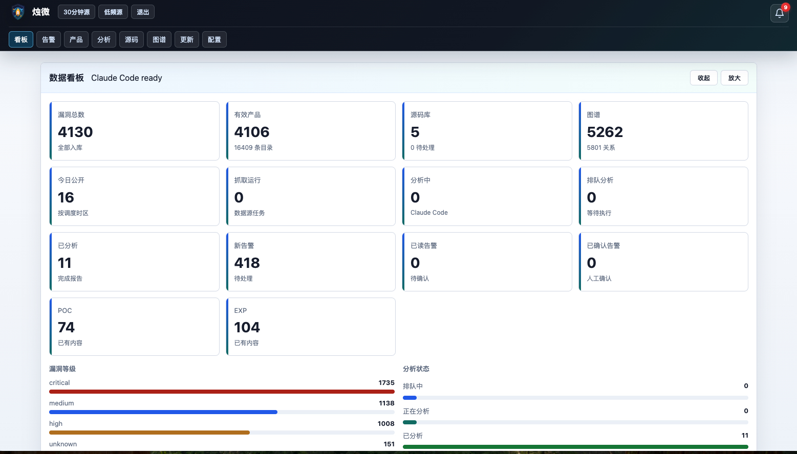
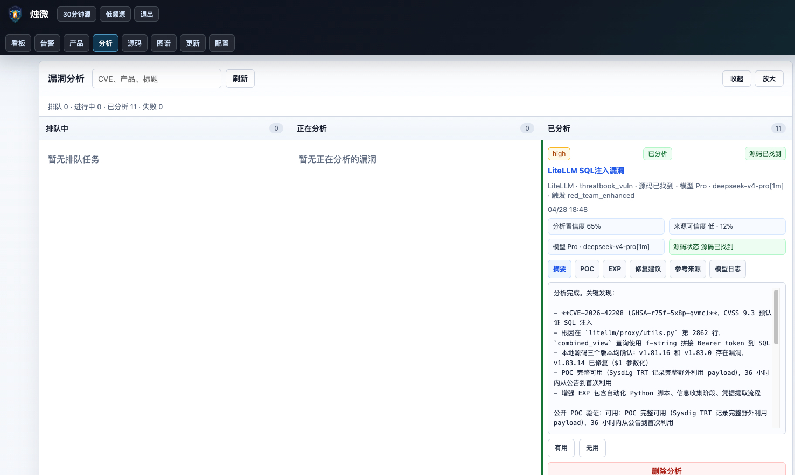
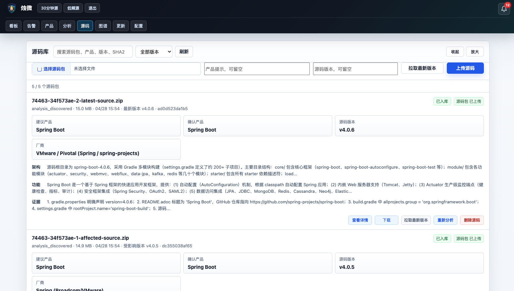
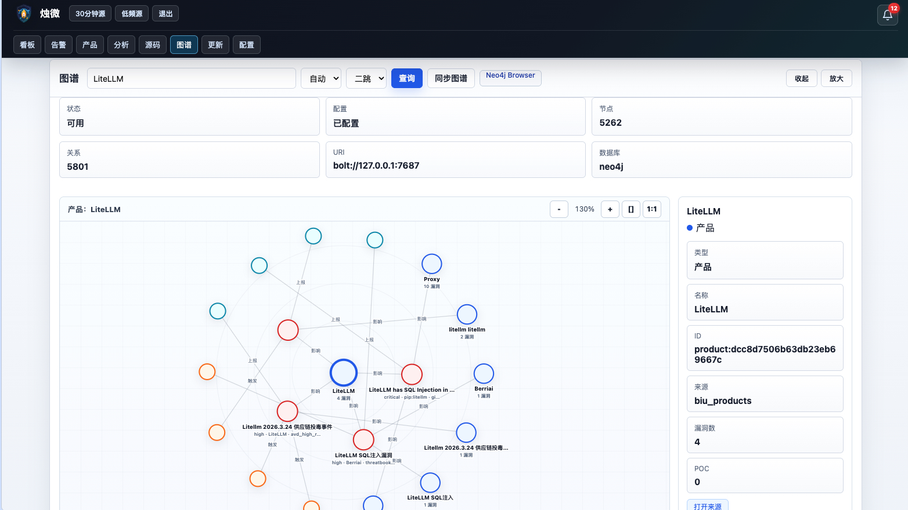

# 404 对 ZhuWei 评审：AI Agent 驱动的创新点与证明

## 一句话结论

ZhuWei 的创新点不在于“爬取更多漏洞信息”，而在于用 AI Agent 主动驱动漏洞研判：Agent 会围绕漏洞自动搜索源码、定位根因、比较版本、分析 POC/EXP，并把源码证据、模型日志、源码包和图谱关系沉淀到后台，形成可追溯的漏洞源码级分析闭环。

## 核心应用价值

ZhuWei 的 AI Agent 能把漏洞情报从“被动阅读”转成“主动利用链/防护链分析”。对红队、渗透测试人员和企业安全团队来说，它的价值不只在于更快看到漏洞，而在于第一时间围绕漏洞完成源码搜索、根因定位、POC/EXP 分析和防护建议沉淀。

### 红队和渗透测试场景

对于红队或渗透人员，ZhuWei 可以第一时间监听多源漏洞情报，并由 AI Agent 自动驱动源码搜索和源码分析。Agent 能围绕 CVE、产品名、公告和仓库线索，快速判断漏洞影响版本、关键源码位置、公开 POC 可用性、EXP 条件和可能的利用链，从而提升红队从“发现情报”到“形成可验证利用思路”的速度。

这类能力的核心收益是：

- 第一时间监听 CISA、NVD、GitHub Advisory、CNVD、AVD、Seebug、OSCS、Doonsec 等多源漏洞信号。
- 自动搜索源码仓库、补丁、版本差异和公开利用证据。
- 通过 AI Agent 辅助定位根因、提取 POC/EXP 关键条件、整理利用链。
- 将分析结果、源码证据、模型日志和图谱关系沉淀，便于复盘和团队协同。

### 企业防护场景

对于企业自身，ZhuWei 可以第一时间发现外部漏洞情报，并自动对齐到产品库和关注资产。当出现相关高危漏洞时，系统可以进一步搜索源码、归档源码包，并由 AI Agent 分析 EXP 利用条件、攻击面、修复版本和防护措施。这样企业可以更快判断“是否受影响、漏洞在哪里、攻击路径是什么、该如何加固”。

ZhuWei 同时支持自行上传源代码。企业可以把内部系统、采购组件、开源依赖或重点产品源码包上传到源码库，由后台异步完成架构识别、功能识别、产品归属和版本记录。后续漏洞分析会优先利用本地源码证据，从而减少临时搜索时间，提高源码级研判速度。

这类能力的核心收益是：

- 第一时间发现与企业资产相关的漏洞情报。
- 通过源码归档和 AI 分析确认影响版本、根因和攻击面。
- 基于 EXP 利用条件反推 WAF、RASP、流量检测、补丁优先级和临时缓解措施。
- 支持企业自行上传源码，提高私有系统和内部组件的源码分析效率。

### 未来规划

后续可以继续强化“后台源码分析”能力：让系统不仅在漏洞触发后分析源码，也能对企业上传的源码库进行持续扫描、结构化理解和风险点挖掘。面向红队，这意味着更快发现潜在利用点；面向企业，这意味着可以更早发现内部代码中的高风险缺陷，甚至辅助挖掘未知漏洞或 0day 线索。

## 配图索引

以下图片路径用于引入后台证明截图。截图内容与当前评审材料一一对应。

## 创新点 1：AI Agent 自动驱动源码搜索与漏洞分析

传统漏洞情报平台通常只做 CVE、公告、RSS 和 POC 列表聚合。ZhuWei 的核心差异是把 AI Agent 引入到漏洞研判流程中：当用户触发分析后，系统会启动 Claude Code Agent，并结合 DeepSeek 模型完成公开情报检索、源码仓库搜索、源码证据识别、根因分析、POC/EXP 判断和修复建议生成。

**证明材料：**

- 后台截图中，LiteLLM SQL 注入漏洞显示触发模式为 `red_team_enhanced`，模型为 `Pro · deepseek-v4-pro[1m]`，状态为“已分析”和“源码已找到”。
- 同一分析结果定位到源码文件 `litellm/proxy/utils.py` 第 2862 行，指出 `combined_view` 查询中使用 f-string 拼接 Bearer token 到 SQL。
- 后台结果同时生成摘要、POC、EXP、修复建议、参考来源、模型日志，并给出分析置信度与来源可信度。
- PostgreSQL 真实库中已有 `365` 条分析事件、`609` 条模型使用记录、`11` 条完成分析。

**代码证明：**

- [backend/app/analysis.py](../backend/app/analysis.py) 中 `enqueue_vulnerability_analysis()` 支持标准分析、重新分析、红队增强分析、模型选择和任务入队。
- [backend/app/analysis.py](../backend/app/analysis.py) 中 `_run_analysis()` 会准备工作目录、加载已有源码上下文、生成 Agent 提示词，并启动 Claude Code CLI 执行检索和分析。
- [backend/app/main.py](../backend/app/main.py) 中 `/api/vulnerabilities/{id}/analysis/run` 支持 `red_team_enhanced`、`model_choice` 和 `analysis_model` 参数。

## 创新点 2：从“漏洞情报”升级到“源码级证据”

ZhuWei 不只保存漏洞标题、描述和公告链接，而是让 AI Agent 继续追问：源码在哪里，漏洞代码在哪里，受影响版本和修复版本如何对应，是否存在可验证的 POC/EXP。这使得平台从情报展示工具升级为源码证据工作台。

**证明材料：**

- LiteLLM 分析截图中，Agent 已将漏洞根因定位到具体源码文件与行号，并给出本地版本验证结论。
- 源码库截图中，Spring Boot 源码被识别为 `v4.0.6` 最新版本，状态为“已入库”和“源码包 已上传”。
- PostgreSQL 真实库中已有 `5` 个源码归档，其中 Spring Boot 同时保留 affected/latest 两类版本：`v4.0.5` 与 `v4.0.6`，并记录架构、功能、厂商、产品名、版本角色、MinIO 状态。

**代码证明：**

- [backend/app/source_archive.py](../backend/app/source_archive.py) 中 `register_analysis_source_artifact()` 支持把 Agent 在分析过程中发现的源码包登记为源码证据。
- [backend/app/source_archive.py](../backend/app/source_archive.py) 中 `process_source_archive_sync()` 对源码包进行异步解包、Manifest 生成、产品识别、架构摘要、功能摘要和 MinIO 上传。
- [backend/app/main.py](../backend/app/main.py) 中 `/api/vulnerabilities/{id}/analysis/source` 支持从漏洞分析结果回跳到源码证据。

## 创新点 3：多模型 Agent 分工，兼顾速度、成本与深度

ZhuWei 不是简单调用一个大模型生成文本，而是将 Agent 工作拆成轻量任务和深度任务。Flash 模型用于产品归属、源码架构识别、轻量检索；Pro 模型用于漏洞根因、攻击面、POC/EXP、修复建议等深度研判。

**证明材料：**

- LiteLLM 分析截图显示深度分析使用 `Pro · deepseek-v4-pro[1m]`。
- Spring Boot 源码库截图显示源码架构与功能识别使用 `deepseek-v4-flash`。
- PostgreSQL 真实库中已有 `609` 条模型使用记录，说明模型调用过程被后台持久化。

**代码证明：**

- [backend/app/analysis.py](../backend/app/analysis.py) 中 `_analysis_model_profile_for_vuln()` 定义 `light_task_model`、`deep_task_model`、`product_attribution_model`、`source_triage_model`、`root_cause_model`、`poc_generation_model`、`fix_advice_model`。
- [backend/app/product_resolution.py](../backend/app/product_resolution.py) 中产品归属解析采用 Flash 先做候选研究，再结合 Pro 和产品库候选做归属判定。

## 创新点 4：GitHub POC/EXP 证据自动搜索与评分

AI Agent 分析之外，ZhuWei 还内置 GitHub 证据搜索能力。系统会围绕 CVE/GHSA 自动搜索 GitHub 仓库和代码命中，区分 advisory、POC、EXP，并给出 score/confidence。这样可以把公开利用线索结构化进入后台，而不是依赖人工逐条搜索。

**证明材料：**

- PostgreSQL 真实库中已有 `200` 条 GitHub evidence。
- 其中 high advisory `114` 条、high exp `17` 条、medium poc `20` 条。
- 漏洞表中已有 GitHub 证据计数和最高评分字段，例如 MongoDB、Citrix NetScaler、Apache ActiveMQ 等漏洞均有多条 GitHub 证据。

**代码证明：**

- [backend/app/github_intel.py](../backend/app/github_intel.py) 中 `refresh_github_evidence_for_vulnerability()` 支持刷新单个漏洞的 GitHub 证据。
- [backend/app/github_intel.py](../backend/app/github_intel.py) 中 `_search_github_evidence()` 同时搜索 repository 和 code。
- [backend/app/main.py](../backend/app/main.py) 中 `/api/vulnerabilities/{id}/github-evidence` 和 `/api/vulnerabilities/{id}/github-evidence/refresh` 提供后台证据查看和刷新接口。

## 创新点 5：产品归属、源码、告警和数据源进入 Neo4j 图谱

ZhuWei 将 Agent 分析结果与产品库、漏洞库、告警和源码库打通，最终同步到 Neo4j 图谱。这样可以查看一个产品周边的漏洞、告警、数据源、源码证据，也可以从单个漏洞追溯到受影响产品和来源。

**证明材料：**

- 后台图谱截图中，LiteLLM 产品周边展示“漏洞 4、产品 7、告警 4、数据源 4、关系 18”。
- PostgreSQL/Neo4j 真实状态显示图谱有 `5262` 个节点、`5801` 条关系。
- 图谱节点类型包括 Product、Vulnerability、Alert、DataSource、SourceArchive，关系包括 AFFECTS、REPORTED、FOR、EVIDENCES。

**代码证明：**

- [backend/app/neo4j_graph.py](../backend/app/neo4j_graph.py) 中 `sync_graph()` 同步 products、vulnerabilities、product_vulnerabilities、alerts、source_archives。
- [backend/app/neo4j_graph.py](../backend/app/neo4j_graph.py) 中 `product_neighborhood()` 和 `vulnerability_neighborhood()` 支持产品/漏洞邻域查询。

## 创新点 6：后台可运营、可追溯、可复盘

ZhuWei 把 Agent 运行过程、源码证据、模型日志和分析结果全部入库，不是一次性对话输出。安全团队可以反复查看模型日志、源码包、POC/EXP、参考来源、图谱关系和分析失败原因，形成可复盘的运营流程。

**证明材料：**

- 后台看板截图显示：漏洞总数 `4130`、有效产品 `4106`、源码库 `5`、图谱 `5262` 节点 / `5801` 关系、已分析 `11`、新告警 `418`。
- 分析截图中包含“模型日志”Tab，可以审计 Agent 执行过程。
- 源码库截图中每个源码包都有状态、版本、产品、厂商、架构、功能、证据、上传状态和下载入口。

**代码证明：**

- [backend/app/main.py](../backend/app/main.py) 中提供 summary、analysis、source-archives、graph、model settings、messages 等后台 API。
- [backend/app/db.py](../backend/app/db.py) 中持久化 vulnerabilities、analysis_events、model_usage_events、source_archives、github_evidence、product_vulnerabilities 等核心表。

## 真实后台数据摘要

以下数据来自当前 PostgreSQL 真实库和 Neo4j 状态：

| 指标 | 数值 |
| --- | ---: |
| 漏洞总数 | 4130 |
| 告警数 | 2031 |
| 新告警 | 418 |
| 有效产品 | 4106 |
| 产品目录条目 | 16409 |
| 产品-漏洞关系 | 11052 |
| GitHub 证据 | 200 |
| 源码归档 | 5 |
| 分析事件 | 365 |
| 模型使用记录 | 609 |
| Neo4j 节点 | 5262 |
| Neo4j 关系 | 5801 |
| 已完成分析 | 11 |

## 可直接用于评审的表述

ZhuWei 的创新点是 AI Agent 驱动的漏洞源码级分析。平台不是把 CISA、NVD、GitHub、CNVD 等信息简单爬取后汇总，而是让 AI Agent 围绕漏洞主动搜索源码、定位根因、比较受影响版本和修复版本、判断 POC/EXP 可用性，并将源码包、模型日志、分析摘要、产品归属和图谱关系沉淀到后台。  

以 LiteLLM SQL 注入漏洞为例，后台分析显示 Agent 已进入红队增强模式，使用 Pro 模型完成分析，并把根因定位到 `litellm/proxy/utils.py` 第 2862 行，同时确认 POC/EXP 状态、修复版本和源码证据。源码库中还能看到 Spring Boot 等项目的 affected/latest 版本源码归档，说明系统已经具备从漏洞情报到源码证据再到图谱关系的闭环能力。

因此，ZhuWei 的核心价值不是“信息更多”，而是“AI Agent 能把信息转成可验证、可复盘、可运营的源码级安全证据”。
